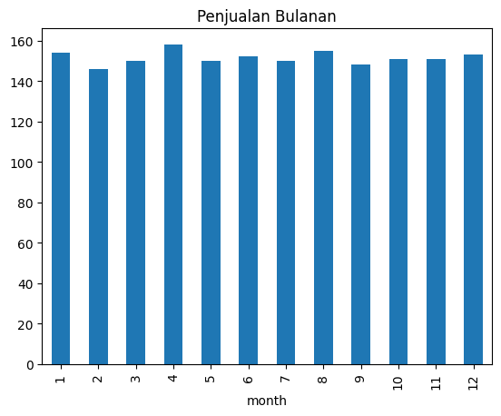
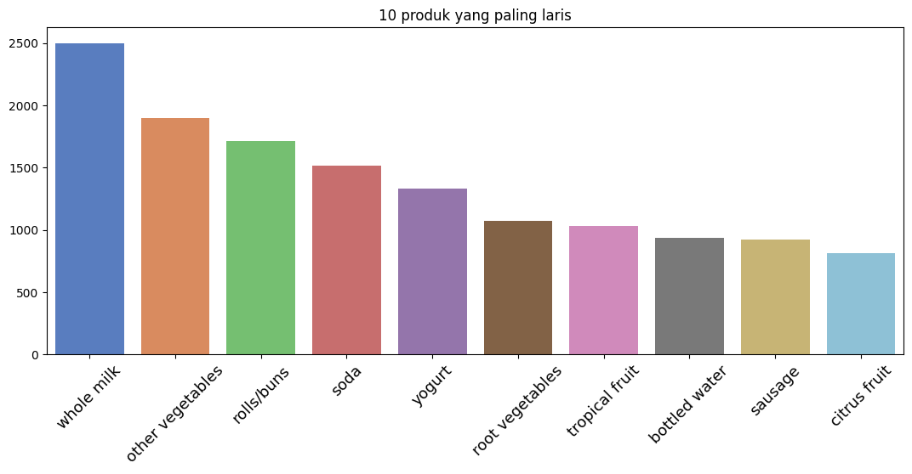
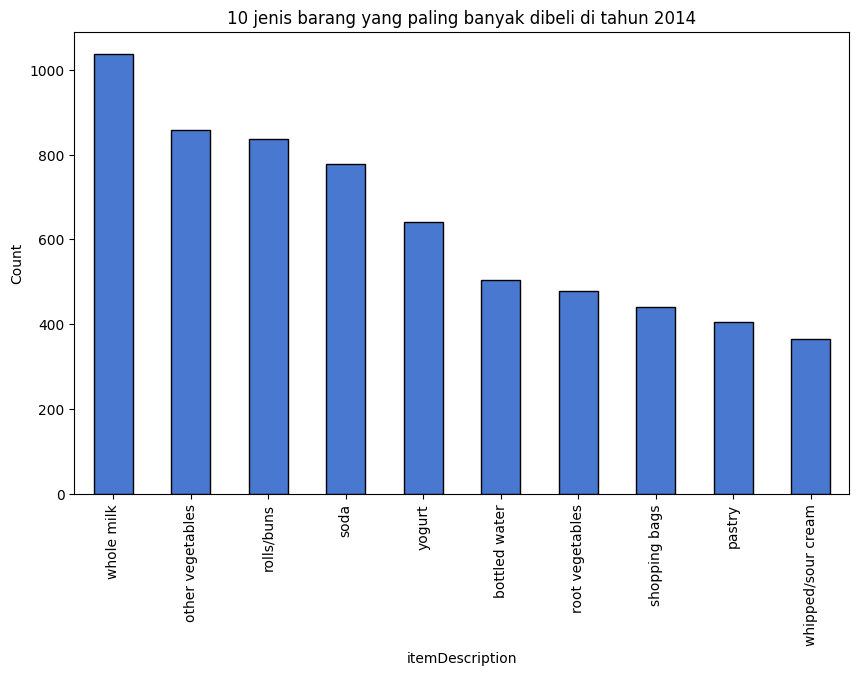
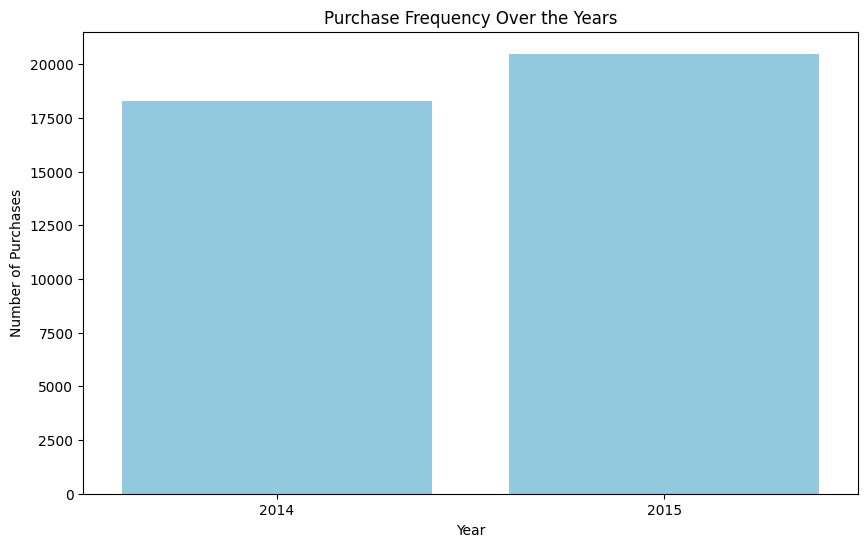
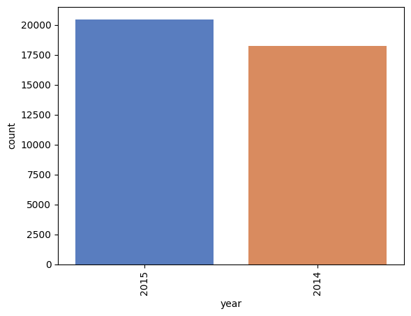
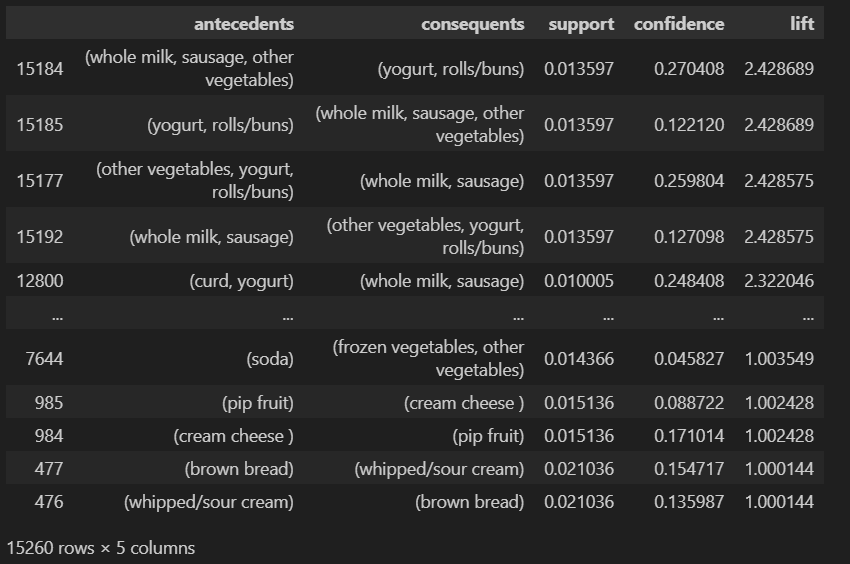

# Laporan Proyek Machine Learning

### Nama : M Daffa Alfikri

### Nim : 211351076

### Kelas : IF Pagi A

## Domain Proyek

## Business Understanding

### Problem Statements

### Goals

### Solution statements

## Data Understanding

### Variabel-variabel pada Klasifikasi Penyakit Jantung adalah sebagai berikut:

## Data Preparation

### Data Collection

### Data Discovery And Profiling

# Import dataset kaggle

- Disini kita upload file kaggle.json kita

```bash
from google.colab import files
files.upload()
```

- Setelah upload akan keliatan file kaggle.json

```bash
!mkdir -p ~/.kaggle
!cp kaggle.json ~/.kaggle/
!chmod 600 ~/.kaggle/kaggle.json
!ls ~/.kaggle
```

- Disini kita download dataset terlebih dahulu atau menarik dataset dari kaggle

```bash
!kaggle datasets download -d rashikrahmanpritom/groceries-dataset-for-market-basket-analysismba
```

- Disini kita extract file yang sudah kita download tadi

```bash
!mkdir market
!unzip groceries-dataset-for-market-basket-analysismba.zip -d market
!ls market
```

# Import library yang di butuhkan

```bash
!pip install apyori
```

```bash
!pip install apriori
```

```bash
import pandas as pd
import numpy as np
import seaborn as sns
import matplotlib.pyplot as plt
%matplotlib inline
from apyori import apriori
from mlxtend.preprocessing import TransactionEncoder
from mlxtend.frequent_patterns import association_rules, apriori
```

# Langkah ketiga Data Discovery

- Disini kita makan menampilkan dataset yang tadi di download

```bash
df = pd.read_csv("market/Groceries data.csv")
print("DataFrame shape:", df.shape)
df.head()
```

- Di sini kita akan mengambil sample acak dari data frame

```bash
df.sample(10)
```

-Menampilkan lengkap mengenai data frame

```bash
df.info()
```

- Menampilkan statistik deskriptif dari data frame

```bash
df.describe()
```

- Menampilkan 10 item deskripsi

```bash
val_counts = df["itemDescription"].value_counts()
val_counts.tail(10)
```

# EDA

- Disini di tampilkan Penjualan yang mana yang paling untung di bulan ke bulan

```bash
df.groupby('month')['itemDescription'].nunique().plot(kind='bar', title='Penjualan Bulanan')
plt.show()
```



- Menunjukan 10 produk paling laris

```bash
plt.figure(figsize=(13,5))
sns.set_palette("muted")

sns.barplot(x = df["itemDescription"].value_counts()[:10].index,
            y = df["itemDescription"].value_counts()[:10].values)
plt.xlabel(""); plt.ylabel("")
plt.xticks(size = 13, rotation = 45)
plt.title('10 produk yang paling laris')
plt.show()
```



- 10 Jenis barang yang di beli di tahun 2014

```bash
df_2014 = df[df['year'] == 2014]
top_10_2014 = df_2014['itemDescription'].value_counts().head(10)

plt.figure(figsize=(10, 6))
top_10_2014.plot(kind='bar', edgecolor='black')
plt.xlabel('itemDescription')
plt.ylabel('Count')
plt.title('10 jenis barang yang paling banyak dibeli di tahun 2014')
plt.show()
```



- Frekuensi Pembelian Selama Bertahun-Tahun

```bash
df['Date'] = pd.to_datetime(df['Date'])
df['year'] = df['Date'].dt.year
year_purchase_counts = df['year'].value_counts().sort_index()

plt.figure(figsize=(10, 6))
sns.barplot(x=year_purchase_counts.index, y=year_purchase_counts.values, color='skyblue')
plt.xlabel('Year')
plt.ylabel('Number of Purchases')
plt.title('Purchase Frequency Over the Years')
plt.show()
```



- Menampilkan data statistik dari tahun 2014-2015

```bash
sns.countplot(x = 'year', data = df, order = df['year'].value_counts().iloc[:25].index)
plt.xticks(rotation=90)
```



# Data Preparation

- Pada tahapan ini kita akan memastikan tipe data yang digunakan sesuai, tidak ada nilai kosong

- Cek type dari setiap kolom

```bash
print('Dataset Information: \n')
print(df.info())
```

-Mencetak 10 data pertama

```bash
print('First Ten Rows of the DataFrame: \n')
print(df.head(10))
```

```bash
print('Unique itemDescription: ', df['itemDescription'].nunique())
```

-Mencetak data itemDescription yang unik (memiliki nilai itemDescription berbeda)

```bash
print('Unique itemDescription: ', df['itemDescription'].nunique())
print( '\n', df['itemDescription'].unique())
```

- Cek missing value zero

```bash
print(df.isnull().sum().sort_values(ascending=False))
```

Member_number 0
Date 0
itemDescription 0
year 0
month 0
day 0
day_of_week 0
Terlihat bahwa pada dataset tidak terdapat missing value dan zeros

- Cek nilai pada kolom item

```bash
print(df[df['itemDescription']=='NONE'])
```

Empty DataFrame
Columns: [Member_number, Date, itemDescription]
Index: []
Tidak terdapat nilai 'NONE' di dataset kita.

Seperti yang bisa kita lihat di atas, fitur Tanggal dan Waktu bukanlah tipe numerik. Untuk visualisasi dan pemahaman data yang lebih baik, kita bisa menambahkan beberapa fitur lagi ke DataFrame ini berdasarkan informasi dari dua fitur ini.

- (ingat kembali penulisan function lambda)

```bash
df['Date'] = pd.to_datetime(df['Date'])
df['Year'] = df['Date'].dt.year
df['Month'] = df['Date'].dt.month
df['Day'] = df['Date'].dt.day

print(df.head())
```

- cek kembali perubahan yang terjadi setelah nilai tahun, bulan dan hari ditampung di fitur baru (year, month, day)

```bash
print(df.info())
print(df.head())
```

# Modelling

- Kita tahu bahwa dataset ini direkam dari 01/01/2014 hingga 30/12/2015. Sebelum kita masuk dalam pemodelan, kita harus mengeksplorasi dan memvisualisasikan penjualan dalam periode waktu ini. Barang apa yang paling banyak dibeli pelanggan? Bulan mana yang lebih sukses? Mari kita jawab ini secara visual.

-Mencetak 20 data penjualan itemDescription terbanyak

```bash
most_sold = df['itemDescription'].value_counts().head(20)

print('Most Sold itemDescription: \n')
print(most_sold)
```

```bash
te = TransactionEncoder()
te_ary = te.fit(transaction_list).transform(transaction_list)
df2 = pd.DataFrame(te_ary, columns=te.columns_)
```

# Visualisasi

- visualisasikan data penjualan itemDescription terbanyak ke line chart dan bar chart

```bash
transaction_list = []

for i in df['Member_number'].unique():
    tlist = list(set(df[df['Member_number']==i]['itemDescription']))
    if len(tlist)>0:
        transaction_list.append(tlist)
print(len(transaction_list))
```

- kita menggunakan TransactionEncoder untuk merubah bentuk transaction_list()

```bash
te = TransactionEncoder()
te_ary = te.fit(transaction_list).transform(transaction_list)
df2 = pd.DataFrame(te_ary, columns=te.columns_)
```

- Sekarang kita terapkan Apriori. Kita akan menggunakan parameter min_threshold (nilai ambang batas yang ditentukan) dalam aturan asosiasi untuk metrik lift menjadi 1,0 karena jika kurang dari satu, maka kedua item tersebut kemungkinan tidak akan dibeli bersama. Kita akan mengurutkan nilai berdasarkan keyakinan untuk melihat kemungkinan suatu bahan makanan dibeli jika pendahulunya dibeli.

```bash
frequent_itemsets = apriori(df2, min_support=0.01, use_colnames=True)
rules = association_rules(frequent_itemsets, metric='lift', min_threshold=1.0)
metrix = pd.DataFrame(rules)
metrix[['antecedents','consequents', 'support', 'confidence', 'lift']].sort_values('lift', ascending=False)
```



```bash
import itertools
def generate_candidates(prev_candidates, k):
    candidates = set()
    for i in range(len(prev_candidates)):
        for j in range(i + 1, len(prev_candidates)):
            itemset1 = set(prev_candidates[i])
            itemset2 = set(prev_candidates[j])
            union_set = itemset1.union(itemset2)
            if len(union_set) == k:
                candidates.add(tuple(sorted(union_set)))
    return list(candidates)

def prune_candidates(candidates, prev_frequent_sets):
    pruned_candidates = []
    for candidate in candidates:
        subsets = [set(x) for x in itertools.combinations(candidate, len(candidate) - 1)]
        is_valid = all(subset in prev_frequent_sets for subset in subsets)
        if is_valid:
            pruned_candidates.append(candidate)
    return pruned_candidates

def apriori(transactions, min_support):
    itemsets = [frozenset([item]) for item in set(item for transaction in transactions for item in transaction)]
    frequent_itemsets = []

    k = 2
    while itemsets:
        candidates = generate_candidates(itemsets, k)
        item_counts = {candidate: 0 for candidate in candidates}

        for transaction in transactions:
            for candidate in candidates:
                if set(candidate).issubset(transaction):
                    item_counts[candidate] += 1

        frequent_itemsets_k = [itemset for itemset, count in item_counts.items() if count / len(transactions) >= min_support]
        frequent_itemsets.extend(frequent_itemsets_k)

        itemsets = prune_candidates(generate_candidates(frequent_itemsets_k, k+1), frequent_itemsets_k)
        k += 1

    return frequent_itemsets

# Contoh Penggunaan
transactions = [
    ['whole milk', 'sausage', 'curd', 'yogurt', 'other vegetables' , 'rolls/buns']
]

min_support = 0.2
result = apriori(transactions, min_support)
print("Frequent Itemsets:")
print(result)
```

- Frequent Itemsets:
  [('sausage', 'whole milk'), ('rolls/buns', 'yogurt'), ('curd', 'other vegetables'), ('other vegetables', 'whole milk'), ('curd', 'yogurt'), ('sausage', 'yogurt'), ('other vegetables', 'yogurt'), ('curd', 'rolls/buns'), ('rolls/buns', 'sausage'), ('whole milk', 'yogurt'), ('curd', 'sausage'), ('curd', 'whole milk'), ('other vegetables', 'rolls/buns'), ('rolls/buns', 'whole milk'), ('other vegetables', 'sausage')]

## Kesimpulan

Berdasarkan analisa hasil yang telah dilakukan, didapatkan kesimpulan sebagai berikut:

- 1.Semakin tinggi nilai suatu lift yang didapatkan menggunakan metode market basket analysis oleh algoritma apriori, maka semakin kuat hubungan antar item barang yang dijual. Data dengan jelas menunjukkan bahwa whole milk adalah bahan makanan yang paling banyak terjual.
- 2.Adanya hubungan pada item Antecedent (IF) yang dibeli pelanggan, maka kemungkinan item Consequent (THEN) diambil oleh pelanggan dengan ID pelanggan yang sama juga.
- 3.Bisnis selalu mencari cara untuk mengoptimalkan pengaturan dan meningkatkan penjualan. Oleh karena sekarang sudah mengetahui pola hubungan antara barang dan kepentingan bersama pelanggan, bisnis dapat membuat keputusan strategi pemasaran berdasarkan penelitian ini. Misalnya, toko groceries mungkin tertarik untuk mengadakan promosi barang gratis, mengingat kemungkinan besar item lain dijual sebagai hasilnya (misalkan, jika mereka mengadakan promo buy 1 get 1 khusus special event, itu mungkin tidak hanya menarik pelanggan baru yang sering datang, tetapi juga ada peluang yang sangat bagus bahwa pelanggan masih akan menghabiskan uang untuk whole milk).

## Saran

Berdasarkan kesimpulan yang telah diuraikan, maka ada beberapa saran yang dapat di sampaikan yaitu:

- 1.Perencanaan strategi penataan dan penempatan bahan makanan sesuai dengan hasil analisis yang berkaitan dengan produk-produk yang sering dibeli bersamaan.
- 2.Diadakannya promo dengan pembelian barang yang sering dibeli dengan barang lainnya yang tidak memiliki hubungan agar barang yang tidak memiliki hubungan tersebut juga dapat cepat terjual habis.
- 3.Pemasangan iklan seperti brosur, spanduk, dan lain-lain dengan menampilkan produk-produk yang sering dibeli oleh konsumen.

# Streamlit App

[Market Data Analyst MBA ] (https://aappciationmarketanalystmba-aezacjq7sf2wasrr5q96v7.streamlit.app/)
